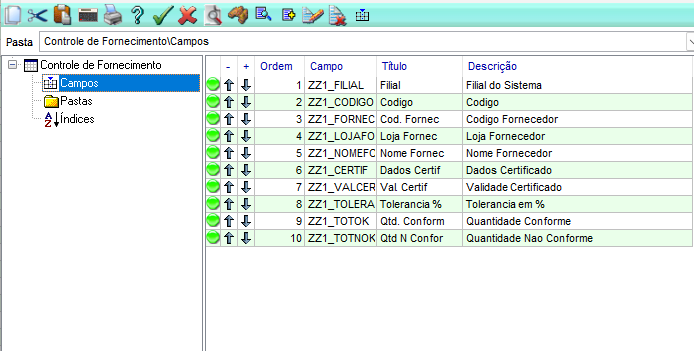
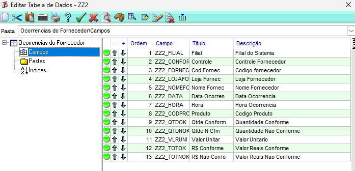
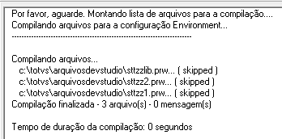
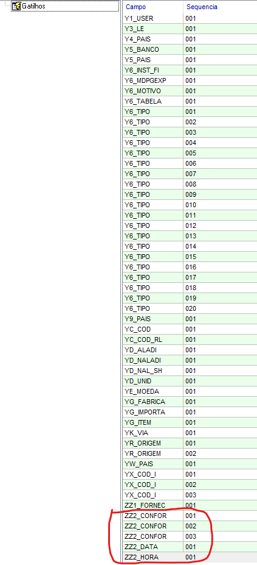
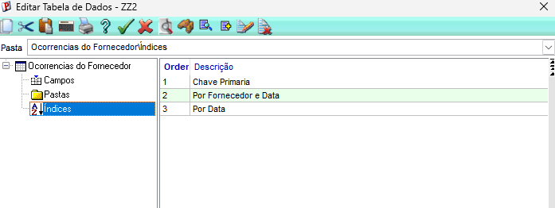
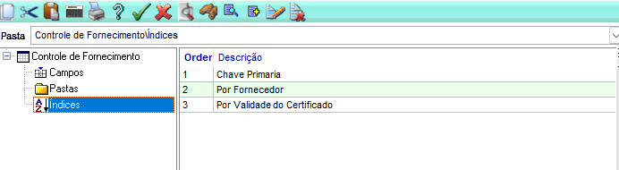

# TCC - Trabalho de Conclusão de Curso: Do Zero ao Protheus (Harbour/ADVPL)

## Sobre o Projeto

Sistema desenvolvido para a Indústria XYZ com o objetivo de monitorar as não conformidades na entrada de materiais dos fornecedores, auxiliando no controle relacionado ao processo de certificação **ISO 9001**.

O projeto engloba o controle de certificados de qualidade dos fornecedores (**ZZ1**) e o registro de ocorrências de não conformidade (**ZZ2**), integrados aos cadastros padrão do ERP TOTVS Protheus (**SA2** e **SB1**).

---

## Integrantes

- **Henrique Rodrigues Mazza do Valle**

---

## Estrutura de Arquivos e Componentes

| Pasta / Arquivo | Descrição |
|---|---|
| **TCC/** | Diretório raiz contendo os arquivos do Trabalho de Conclusão de Curso. |
| **Dados-e-Dicionario/** | Arquivos relacionados às tabelas, dicionário de dados e configurações utilizadas no projeto. |
| **evidencias/** | Prints e evidências do desenvolvimento e funcionamento do projeto. |
| **STTZZ1.PRW** | Rotina principal para gerenciamento e manutenção da tabela ZZ1, incluindo acesso às ocorrências e validações. |
| **STTZZ2.PRW** | Rotina para gerenciamento das ocorrências da tabela ZZ2, incluindo filtro e validações. |
| **STTZZLIB.PRW** | Biblioteca de funções auxiliares utilizadas pelas rotinas do projeto. |
| **TCC-Documentacao.docx** | Documentação técnica completa do projeto, contendo explicações, procedimentos e evidências. |

---

## Estrutura das Tabelas

### ZZ1 - Controle de Fornecimento

Tabela responsável pelo cadastro dos controles de fornecimento e certificados dos fornecedores.

**Principais campos:**

`ZZ1_FILIAL`, `ZZ1_CODIGO`, `ZZ1_FORNEC`, `ZZ1_LOJAFO`, `ZZ1_NOMEFO`, `ZZ1_CERTIF`, `ZZ1_VALCER`, `ZZ1_TOLERA`, `ZZ1_TOTOK`, `ZZ1_TOTNOK`.

### ZZ2 - Ocorrências de Não Conformidade

Tabela responsável pelo registro das ocorrências relacionadas aos controles cadastrados na ZZ1.

**Principais campos:**

`ZZ2_FILIAL`, `ZZ2_CONFOR`, `ZZ2_FORNEC`, `ZZ2_LOJAFO`, `ZZ2_NOMEFO`, `ZZ2_DATA`, `ZZ2_HORA`, `ZZ2_CODPRO`, `ZZ2_QTDOK`, `ZZ2_QTDNOK`, `ZZ2_VLRUNI`, `ZZ2_TOTOK`, `ZZ2_TOTNOK`.

---

## Funcionalidades Desenvolvidas

- Cadastro e manutenção dos controles de fornecimento e certificados;
- Controle da validade dos certificados;
- Definição de percentual de tolerância para não conformidades;
- Cadastro e manutenção das ocorrências;
- Relacionamento entre ZZ1 e ZZ2;
- Filtro das ocorrências pelo controle selecionado;
- Validação de fornecedores cadastrados na **SA2**;
- Validação de produtos cadastrados na **SB1**;
- Validação do percentual de tolerância;
- Controle das quantidades conformes e não conformes;
- Legendas para acompanhamento da situação dos certificados.

---

## O Que Foi Desenvolvido

O projeto foi desenvolvido utilizando **ADVPL/Harbour** no ambiente **TOTVS Protheus 8**.

Foram desenvolvidas as rotinas:

- **STTZZ1.PRW** — gerenciamento dos controles de fornecimento e certificados;
- **STTZZ2.PRW** — gerenciamento das ocorrências de não conformidade;
- **STTZZLIB.PRW** — funções auxiliares compartilhadas entre as rotinas.

Também foram configuradas as tabelas customizadas **ZZ1** e **ZZ2**, seus campos, índices e demais elementos necessários no dicionário de dados do Protheus.

---
## Dicionário de Dados - Tabela ZZ1 (Controle de Fornecimento) 

**Tabela:** ZZ1 - Controle de Fornecedores / ISO 9001

### Campos (SX3)
| Campo | Tipo | Tamanho | Decimal | Título | Descrição | Obrigatório |
| :--- | :---: | :---: | :---: | :--- | :--- | :---: |
| ZZ1_FILIAL | C (Caracter) | 2 | 0 | Filial | Filial do Sistema | Sim |
| ZZ1_COD | C (Caracter) | 6 | 0 | Código | Código do Fornecedor | Sim |
| ZZ1_LOJA | C (Caracter) | 2 | 0 | Loja | Loja do Fornecedor | Sim |
| ZZ1_NOME | C (Caracter) | 40 | 0 | Nome | Nome do Fornecedor | Sim |
| ZZ1_TOLERA | N (Numérico) | 5 | 2 | Tolerância (%) | % de Tolerância ISO | Não |

### Índices (SIX)
| Ordem | Chave do Índice | Descrição |
| :---: | :--- | :--- |
| 1 | ZZ1_FILIAL + ZZ1_COD + ZZ1_LOJA | Busca por Código (Chave Primária) |
| 2 | ZZ1_FILIAL + ZZ1_NOME | Busca Alfabética por Nome |

### Tabela (SX2)
| Tabela (Chave) | Arquivo Físico | Descrição | Modo |
| :--- | :--- | :--- | :--- |
| ZZ1 | ZZ1990 | Controle de Fornecedores ISO | E (Exclusivo) |

### Campos (SX3)
| Campo | Tipo | Tamanho | Decimal | Título | Obrigatório | Validação (X3_VLDUSER) |
| :--- | :---: | :---: | :---: | :--- | :---: | :--- |
| ZZ1_FILIAL | C | 2 | 0 | Filial | Sim | |
| ZZ1_COD | C | 6 | 0 | Código | Sim | ExistCpo("SA2") |
| ZZ1_LOJA | C | 2 | 0 | Loja | Sim | |
| ZZ1_NOME | C | 40 | 0 | Nome | Sim | |
| ZZ1_TOLERA | N | 5 | 2 | Tolerância(%) | Não | M->ZZ1_TOLERA >= 0 .And. M->ZZ1_TOLERA <= 100 |
---

## Como Executar

1. Disponibilizar os arquivos presentes na pasta **Dados-e-Dicionario/** no ambiente Protheus.
2. Compilar os fontes:
   - `STTZZLIB.PRW`
   - `STTZZ1.PRW`
   - `STTZZ2.PRW`
3. Configurar o menu do módulo de Compras com a rotina do projeto.
4. Iniciar o **TOTVS Protheus SmartClient**.
5. Acessar o módulo configurado.
6. Executar as rotinas **STTZZ1** e **STTZZ2**.

---

## Documentação

A documentação técnica completa do projeto está disponível em:

**[Documentação Técnica do Projeto](TCC-Documentacao.pdf)**

O documento contém as explicações detalhadas das rotinas, configurações, regras de negócio, procedimentos e evidências do desenvolvimento.

---

## Tecnologias Utilizadas

- ADVPL
- Harbour
- TOTVS Protheus 8
- DevStudio / MP8 IDE
- SmartClient
- Git / GitHub

---

## Evidências

`evidencias/`
As evidências estão especificadas após a explicação de cada campo na documentação!

Aqui está uma compilação delas individualmente:

### Campos da ZZ1

### Campos da ZZ2

### Compilação

### Gatilhos

### Índices da ZZ2

### Índices da ZZ1

---

**Programa START TOTVS Paulista**

**2026**