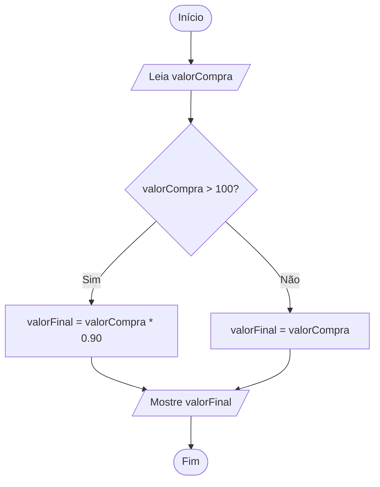

# Exercício 3 — Fluxograma

```mermaid
flowchart TD
    A([Início]) --> B[/Leia valorCompra/]
    B --> C{valorCompra > 100?}
    
    C -- Sim --> D[valorFinal = valorCompra * 0.90]
    C -- Não --> E[valorFinal = valorCompra]
    
    D --> F[/Mostre valorFinal/]
    E --> F
    
    F --> G([Fim])
```